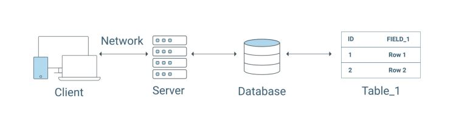
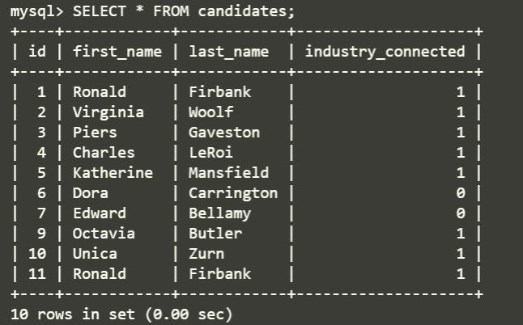
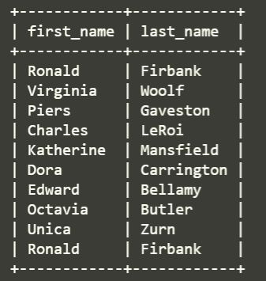
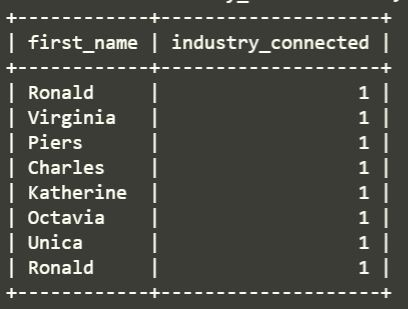
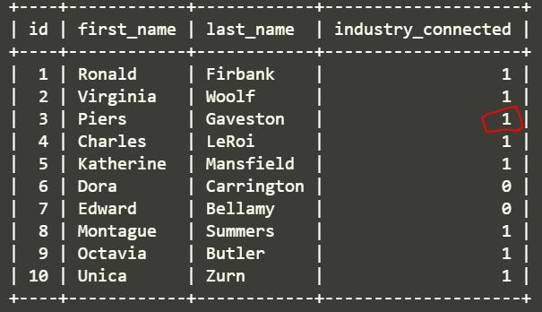
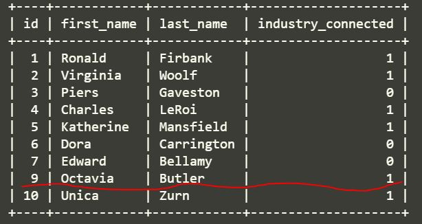

# SQL- [structured query language](https://en.wikipedia.org/wiki/SQL)

*  A relational database stores and finds data based on its relationship to other data in the database. The data is organized in tables composed of rows and columns, much like spreadsheets. This crucial ability to store and retrieve data makes databases the foundation of full-stack web applications.
* **little history**: SQL has remained popular since its creation in 1970. Through numerous generations of technology, many enterprise applications have entrenched themselves in SQL databases due to their centralized security, scalability, and ability to handle numerous concurrent requests. As one of the most sought-after skills by recruiters, SQL is a powerful language that's used in a majority of databases in every economic sector, from manufacturing, logistics, and health care to insurance, commerce, and much more.



# WHAT I LEARNED FROM THIS MODULE

* configure a Node.js application to connect to a SQL instance.
* create and drop database and tables.
* Explain and execute CRUD method.
* create schema and seed filers for development and production.
* write join statement to eststablish relations between data in one or more tables using primary and foreign keys.
* Explain the use and importance of prepared statements.

# project description
*  build the back end for U Vote It, a voting application for a local developer meetup group called U Develop It
* In addition to building the Express.js API,  we'll connect the back end to a relational database using MySQL.

# tools required

* [mysql](https://www.mysql.com/)**-** is considered the most reliable, scaleable, and developer-friendly open source relational database management system. It powers the back end of many of the popular social, streaming, and service web applications.
* [mysql2](https://www.npmjs.com/package/mysql2)**-** is a MySQL client for Node.js with a focus on performance. This is the npm package you'll use to connect your Node.js applications to a MySQL database.

[Mysql installation guide](https://coding-boot-camp.github.io/full-stack/mysql/mysql-installation-guide)

## first section we will concentrate to accomplish:
* use MySQL to create a database
* use SQL to create and populate a table of data.
* Run SQL queries to create, read, update and delete data from a table.

# CRUD
* is acronym for creating, reading, updating and deleting records.

# project flow

# **Title:** Create a database that contains the candidates table

  **Body:**
  **User Story**

  * As a user, I can request a list of all potential candidates.

  * As a user, I can request a single candidate's information.

  * As a user, I want to delete a candidate.

  * As a user, I want to create a candidate.

# **Title:** Create the parties table

  **Body:**
  **User Story**

  * As a user, I can update a candidate's party affiliation.

  * As a user, I can request a single candidate's information, including party affiliation.

  * As a user, I can request a list of all the parties.

  * As a user, I can request a single party's information.

  * As a user, I can delete a party.

  * As a user, I can request a single candidate's information.

  * As a user, I want to delete a candidate.

  * As a user, I want to create a candidate.

# **Title:** Create the voters table

  **Body:**
  **User Story**

  * As a user, I can request a list of voters alphabetized by last name.

  * As a user, I can request a single voter's information.

  * As a user, I can create a voter.

  * As a user, I can update a voter's email.

  * As a user, I can delete a voter.

# **Title:** Create the votes table

  **Body:**
  **User Story**

  * As a user, I can tabulate all the votes cast by candidate ID in descending order.

  * As a user, I can cast a vote for a candidate.

  * check **mysql --version** and confirm mysql is dowloaded and running good if so we will get this,
  
  or and error message.

  # what is database , table and query
  * **database** is a collection of interrelated data. This data is stored in one or more tables that are related to one another.
  *  **table** is composed of rows and columns. A column represents a field. A row represents a record.
  * **query** is a request for data from a database table or a combination of tables.

  * we will create a database first and the reason why we create a database first because database will at as a parent container that will store the interrelated tables of data.

  * to start MySQL shell
  type **mysql -u root -p** on the terminal.
  * **mysql>** command shows that we are in sql shell.
  * Now we create election database typing
  **CREATE DATABASE election;** 
  * to use the database tyoe **USE election;**

# create candidate table using the MySQL CLI

````
CREATE TABLE candidates (
  id INTEGER AUTO_INCREMENT PRIMARY KEY,
  first_name VARCHAR(30) NOT NULL,
  last_name VARCHAR(30) NOT NULL,
  industry_connected BOOLEAN NOT NULL
);
````
* **DESCRIBE candidate;** can see the candidate table created.

* add data to table
````
INSERT INTO candidates (first_name, last_name, industry_connected)
VALUES ('Ronald', 'Firbank', 1);

`````
* type **SELECT * FROM candidates;** 


* Insert data
````
INSERT INTO candidates (first_name, last_name, industry_connected)
VALUES
  ('Virginia', 'Woolf', 1),
  ('Piers', 'Gaveston', 0),
  ('Charles', 'LeRoi', 1),
  ('Katherine', 'Mansfield', 1),
  ('Dora', 'Carrington', 0),
  ('Edward', 'Bellamy', 0),
  ('Montague', 'Summers', 1),
  ('Octavia', 'Butler', 1),
  ('Unica', 'Zurn', 1);

  ````


* type **SELECT * FROM candidates;**




* SELECT first_name, last_name FROM candidates;



*  SELECT first_name, industry_connected
FROM candidates
WHERE industry_connected = 1;





* [WHERE clause](https://dev.mysql.com/doc/refman/8.0/en/comparison-operators.html): is a powerful filtering tool that can be used with equality operators like less than (<) or not equal to (!=). We can also use the OR and AND logical operators to evaluate multiple conditions. If the expression evaluates to true, the row is returned.

# Save queries in schema and seed files
* we will create files for database and table creation called **dq.sql** and **schema.sql**
* and use these files to create and populate the **candidate** table.

* to delete database **DROP DATABASE election;**

* we have now deleted the election database and added new database election in db/db.sql noe to create database on the file type:
````
source db/db.sql
````
* to verify tyoe **DESCRIBE candidates;**

* added table details to seed.sql file
````
INSERT INTO candidates (first_name, last_name, industry_connected)
VALUES
  ('Ronald', 'Firbank', 1),
  ('Virginia', 'Woolf', 1),
  ('Piers', 'Gaveston', 0),
  ('Charles', 'LeRoi', 1),
  ('Katherine', 'Mansfield', 1),
  ('Dora', 'Carrington', 0),
  ('Edward', 'Bellamy', 0),
  ('Montague', 'Summers', 1),
  ('Octavia', 'Butler', 1),
  ('Unica', 'Zurn', 1);

  ````
  * **source db/seeds.sql** to source the file
  * **SELECT * FROM candidates;** to see newly created table.

  * we use **UPDATE** command to uodate the table
  ````
  UPDATE candidates
SET industry_connected = 1
WHERE id = 3;
````


* **DELETE** command:
 ````
 DELETE FROM candidates
WHERE first_name = "Montague";
````


* see row deleted including id, in SQL database each row has its own unique ID.

* can use **quit** command in terminal to end and get out of SQL shell.


